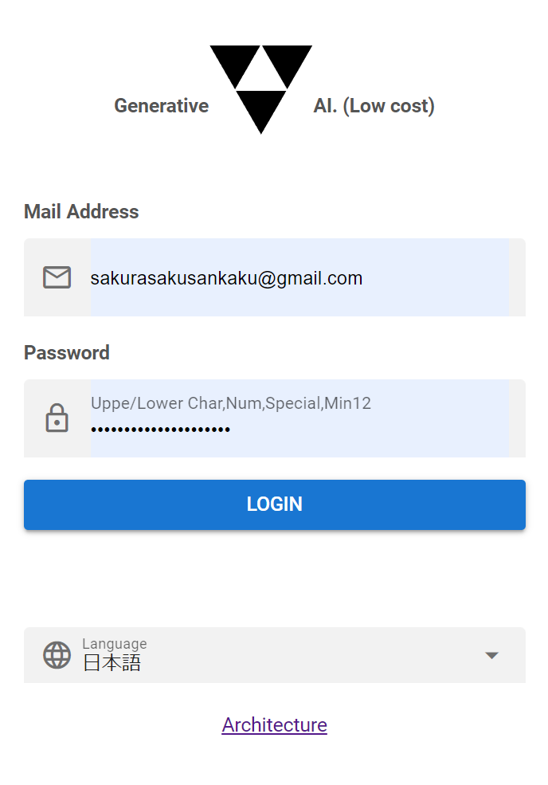
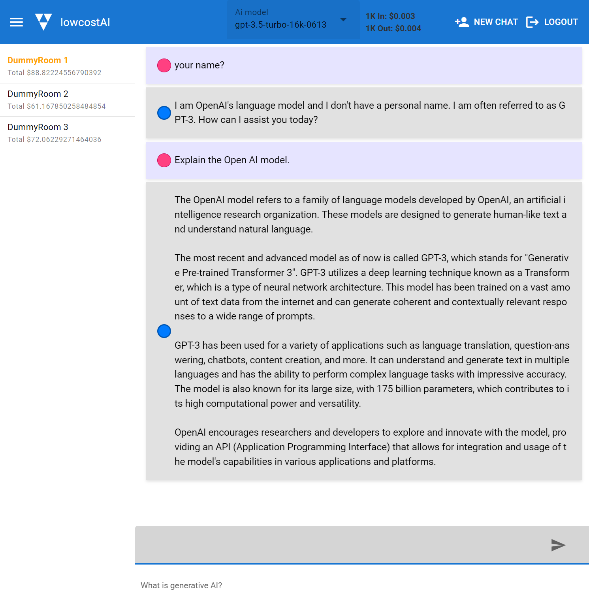

# Currently under development. 現在開発中です。

# This is a low-cost generative AI web project.
Generative AI realizes pay-as-you-go billing using external APIs.
The server realizes pay-as-you-go billing in a serverless environment.
You only have to pay for what you use, but if you don't use it, we are thinking of a solution that will make the cost extremely low.  
  
It is possible to create a generative AI environment at a lower cost than the always-on EC2. However, the installation cost is slightly higher than the container type. CloudFormation may alleviate some of this.

# Architecture(Use AWS)
There may be more SQS in the future.

# Login(This is a screen under development.)

# Chat(This is a screen under development.)
We are thinking about a design that is easy to see.  

# project
This is a project under development.

## aws-low-cost-gpt-client
Vue, Quasar client web screen.

## aws-low-cost-gpt-dummy-api
This is a Java dummy server. Spring boot is used. If you have an Open AI API key, you can chat with the generated AI even in the local environment.

## aws-low-cost-gpt-lambda
I am implementing AWS Lambda in Java. Collaborates with Dynamo DB and external services.

## aws-low-cost-gpt-model
This is a model class used by the dummy server and lambda.
